# Divot: Diffusion Powers Video Tokenizer for Comprehension and Generation
[](https://arxiv.org/abs/2412.04432)
[](https://huggingface.co/TencentARC/Divot)


>We introduce [Divot](https://arxiv.org/abs/2412.04432), a **Di**ffusion-Powered **V**ide**o** **T**okenizer, which leverages the diffusion process for self-supervised video representation learning. We posit that if a video diffusion model can effectively de-noise video clips by taking the features of a video tokenizer as the condition, then the tokenizer has successfully captured robust spatial and temporal information. Additionally, the video diffusion model inherently functions as a de-tokenizer, decoding videos from their representations.
Building upon the Divot tokenizer, we present **Divot-LLM** through video-to-text autoregression and text-to-video generation by modeling the distributions of continuous-valued Divot features with a Gaussian Mixture Model.

All models, training code and inference code are released!


## TODOs
- [x] Release the pretrained tokenizer and de-tokenizer of Divot.
- [x] Release the pretrained and instruction tuned model of Divot-LLM.
- [x] Release inference code of Divot.
- [x] Release training and inference code of Divot-LLM.
- [ ] Release training code of Divot.
- [ ] Release de-tokenizer adaptation training code.

## Introduction


We utilize the diffusion procedure to learn **a video tokenizer** in a self-supervised manner for unified comprehension and
generation, where the spatiotemporal representations serve as the
condition of a diffusion model to de-noise video clips. Additionally,
the proxy diffusion model functions as a **de-tokenizer** to decode
realistic video clips from the video representations.

After training the the Divot tokenizer, video features from the Divot tokenizer are fed into the LLM to perform next-word prediction for video comprehension, while learnable queries are input into the LLM to model the distributions of Divot features using **a Gaussian Mixture Model (GMM)** for video generation. During inference,
video features are sampled from the predicted GMM distribution to
decode videos using the de-tokenizer.

## Showcase
### Video Reconstruction of Divot
<table class="center" style="width: 100%; text-align: center;">
  <tr>
    <td style="width: 25%;">
                    <span style="text-align: center;">Input</span>
      <div style="display: flex; flex-direction: column; align-items: center;">
        
      </div>
    </td>
    <td style="width: 25%;">
      <span style="text-align: center;">Input</span>
      <div style="display: flex; flex-direction: column; align-items: center;">
        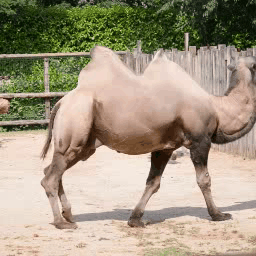
      </div>
    </td>
    <td style="width: 25%;">
      <span style="text-align: center;">Input</span>
      <div style="display: flex; flex-direction: column; align-items: center;">
        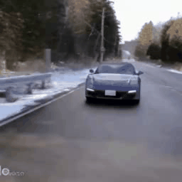
      </div>
    </td>
    <td style="width: 25%;">
     <span style="text-align: center;">Input</span>
      <div style="display: flex; flex-direction: column; align-items: center;">
        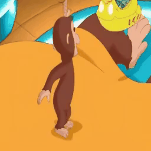
      </div>
    </td>
  </tr>
  <tr>
    <td style="width: 25%;">
       <span>Reconstructed</span>
      <div style="display: flex; flex-direction: column; align-items: center;">
        
      </div>
    </td>
    <td style="width: 25%;">
       <span>Reconstructed</span>
      <div style="display: flex; flex-direction: column; align-items: center;">
        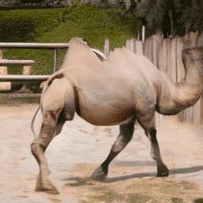
      </div>
    </td>
    <td style="width: 25%;">
       <span>Reconstructed</span>
      <div style="display: flex; flex-direction: column; align-items: center;">
        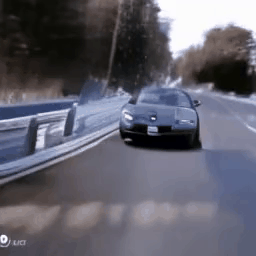
      </div>
    </td>
    <td style="width: 25%;">
       <span>Reconstructed</span>
      <div style="display: flex; flex-direction: column; align-items: center;">
        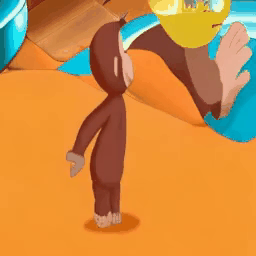
      </div>
    </td>
  </tr>
</table>

### Video Comprehension of Divot-LLM


### Video Generaion of Divot-LLM

<table class="center" style="width: 100%; text-align: center;">

  <tr>
    <td style="width: 25%;">A person is applying eye makeup</td>
    <td style="width: 25%;">A gorgeous girl is smiling</td>
    <td style="width: 25%;">A time-lapse of clouds passing over a peaceful mountain lake with reflections of the peaks</td>
    <td style="width: 25%;">Back view of a young woman dressed in a yellow</td>
  </tr>
  <tr>
    <td style="width: 25%;">
      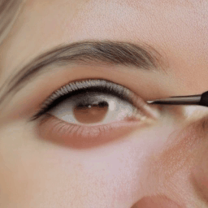
    </td>
    <td style="width: 25%;">
      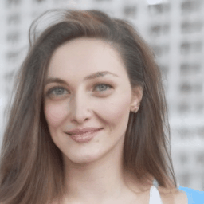
    </td>
    <td style="width: 25%;">
      
    </td>
    <td style="width: 25%;">
      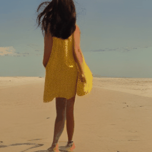
    </td>
  </tr>
  <tr>
    <td style="width: 25%;">Water is slowly filling a glass</td>
    <td style="width: 25%;">People cheer at fireworks display</td>
    <td style="width: 25%;">A cute dog observing out the window</td>
    <td style="width: 25%;">An oil painting depicting a beach with wave</td>
  </tr>
  <tr>
    <td style="width: 25%;">
      
    </td>
    <td style="width: 25%;">
      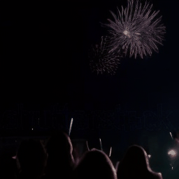
    <td style="width: 25%;">
      
    </td>
    <td style="width: 25%;">
      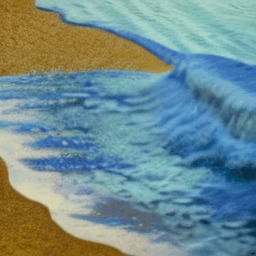
    </td>
    </td>
  </tr>
  <tr>
    <td style="width: 25%;">A drone view of a stunning waterfall in a rainforest</td>
    <td style="width: 25%;">A digital art piece of a cyberpunk cityscape at night</td>
    <td style="width: 25%;">A guy wearing a jacket is driving a car</td>
    <td style="width: 25%;">An aerial shot of a vibrant hot air balloon festival</td>
  </tr>
  <tr>
    <td style="width: 25%;">
      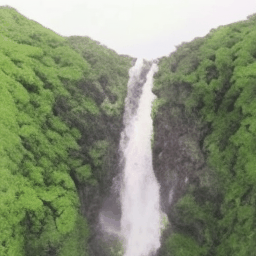
    </td>
    <td style="width: 25%;">
      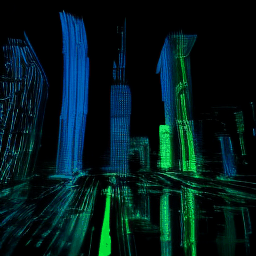
    </td>
        <td style="width: 25%;">
      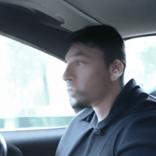
    </td>
    <td style="width: 25%;">
      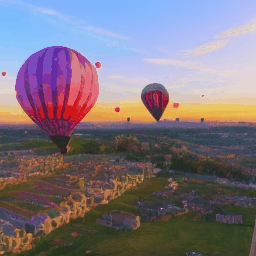
    </td>
  </tr>
</table>

### Video StoryTelling of Divot-LLM

<table class="center" style="width: 100%; text-align: center;">

>Instruction: Generate a story about George's visit to the dentist.
  <tr>
    <td style="width: 33%;">George felt nervous as the kind dentist explained the check-up to make him comfortabl.</td>
    <td style="width: 33%;">At the dentist's office, George opened wide so the dentist could examine his teeth.</td>
    <td style="width: 33%;">George then learns about dental hygiene from a friendly dentist showing him the tools and techniques.</td>
  </tr>
  <tr>
    <td style="width: 33%;">
      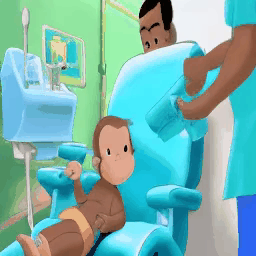
    </td>
    <td style="width: 33%;">
      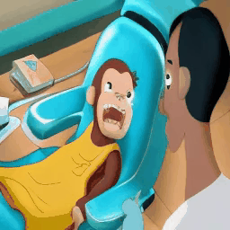
    </td>
    <td style="width: 33%;">
      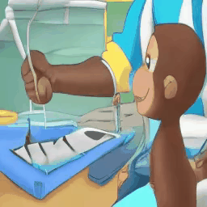
    </td>
  </tr>
</table>

 <table class="center" style="width: 100%; text-align: center;">

  >Instruction: Generate a story about George‘s fun-filled day in the kitchen.

  <tr>
    <td style="width: 33%;">George and his pal joyfully cook in the kitchen, creating a tasty snack with a big blue book.</td>
    <td style="width: 33%;">A woman in the kitchen shows
George how to use a new kitchen gadget.</td>
    <td style="width: 33%;">George spreads the thick, peanutty
paste, making a yummy snack.</td>
  </tr>
  <tr>
    <td style="width: 33%;">
      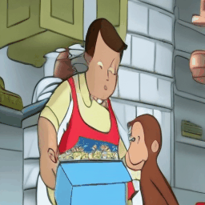
    </td>
    <td style="width: 33%;">
      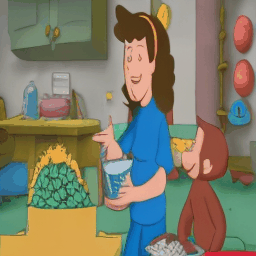
    </td>
    <td style="width: 33%;">
      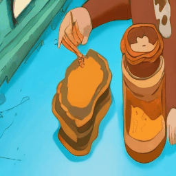
    </td>
  </tr>

</table>

## Usage

### Dependencies
- Python >= 3.8 (Recommend to use [Anaconda](https://www.anaconda.com/download/#linux))
- [PyTorch >=2.1.0](https://pytorch.org/)
- NVIDIA GPU + [CUDA](https://developer.nvidia.com/cuda-downloads)

### Installation
Clone the repo and install dependent packages

  ```bash
  git clone https://github.com/TencentARC/Divot.git
  cd Divot
  pip install -r requirements.txt
  ```

### Model Weights
We release the pretrained tokenizer and de-tokenizer, pre-trained and instruction-tuned Divot-LLM in [Divot](https://huggingface.co/TencentARC/Divot/). Please download the checkpoints and save them under the folder `./pretrained`. For example, `./pretrained/Divot_tokenizer_detokenizer`.


You also need to download [Mistral-7B-Instruct-v0.1](https://huggingface.co/mistralai/Mistral-7B-Instruct-v0.1) and [CLIP-ViT-H-14-laion2B-s32B-b79K](https://huggingface.co/laion/CLIP-ViT-H-14-laion2B-s32B-b79K), and save them under the folder `./pretrained`.

### Inference
#### Video Reconstruction with Divot
```bash
python3 src/tools/eval_Divot_video_recon.py
```

#### Video Comprehension with Divot-LLM
```bash
python3 src/tools/eval_Divot_video_comp.py
```

#### Video Generation with Divot-LLM
```bash
python3 src/tools/eval_Divot_video_gen.py
```


### Training
#### Pre-training
1. Download the checkpoints of pre-trained [Mistral-7B-Instruct-v0.1](https://huggingface.co/mistralai/Mistral-7B-Instruct-v0.1) and [CLIP-ViT-H-14-laion2B-s32B-b79K](https://huggingface.co/laion/CLIP-ViT-H-14-laion2B-s32B-b79K) , and save them under the folder `./pretrained`.
2. Prepare the training data in the format of webdataset.
3. Run the following script.
```bash
sh scripts/train_Divot_pretrain_comp_gen.sh
```

#### Instruction-tuning
1. Download the checkpoints of pre-trained Divot tokenizer and Divot-LLM in [Divot](https://huggingface.co/TencentARC/Divot/), and save them under the folder `./pretrained`.
2. Prepare the instruction data in the format of webdataset (for generation) and jsonl (for comprehension, where each line stores a dictionary used to specify the video_path, question, and answer).
3. Run the following script.
```bash
### For video comprehension
sh scripts/train_Divot_sft_comp.sh

### For video generation
sh scripts/train_Divot_sft_gen.sh
```

#### Inference with your own model
1. Obtain "pytorch_model.bin" with the following script.
```bash
cd train_output/sft_comp/checkpoint-xxxx
python3 zero_to_fp32.py . pytorch_model.bin
```
2. Merge your trained lora with the original LLM model using the following script.
```bash
python3 src/tools/merge_agent_lora_weight.py
```
3. Load your merged model in "mistral7b_merged_xxx" and and corresponding "agent" path, For example,
```bash
llm_cfg_path = 'configs/clm_models/mistral7b_merged_sft_comp.yaml'
agent_cfg_path = 'configs/clm_models/agent_7b_in64_out64_video_gmm_sft_comp.yaml'
```


## License
`Divot` is licensed under the Apache License Version 2.0 for academic purpose only except for the third-party components listed in [License](License.txt).

## Citation
If you find the work helpful, please consider citing:
```bash
@article{ge2024divot,
  title={Divot: Diffusion Powers Video Tokenizer for Comprehension and Generation},
  author={Ge, Yuying and Li, Yizhuo and Ge, Yixiao and Shan, Ying},
  journal={arXiv preprint arXiv:2412.04432},
  year={2024}
}
```

## Acknowledge
Our code for Divot tokenizer and de-tokenizer is built upon [DynamiCrafter](https://github.com/Doubiiu/DynamiCrafter). Thanks for their excellent work!
